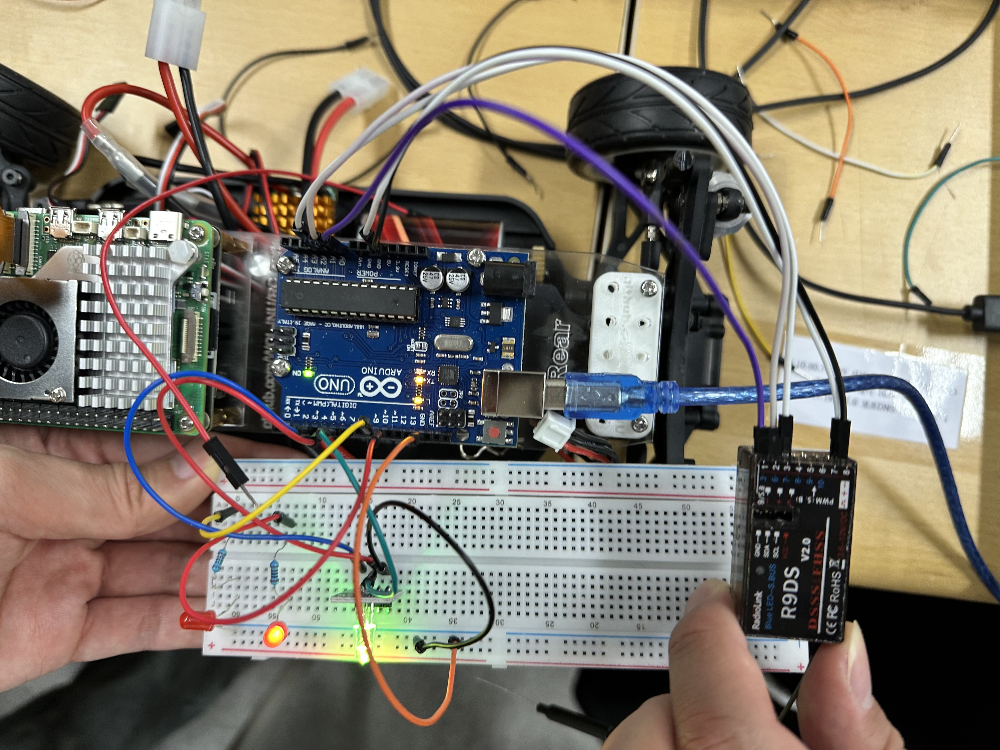

# 🛰️ Arduino + R9DS + RadioLink RC 3채널 LED Controller
youtube : https://youtu.be/1z5E2n8aHBc

이 프로젝트는 **RadioLink 조종기(AT9/T9/T9S 등)** 와 **R9DS 수신기**를 이용해,  
아두이노로 **LED 2개 및 RGB 조명을 PWM 신호로 제어하는 시스템**입니다.

 

## 🧰 구성 부품

| 부품 | 설명 |
|------|------|
| RadioLink 조종기 (AT9/AT9S 등) | RC 신호 송신기 |
| R9DS 수신기 | PWM 신호 수신 장치 |
| Arduino UNO/Nano 등 | 제어 MCU |
| LED 2개 | 일반 LED (On/Off + 밝기 조절용) |
| RGB LED | 색상 전환용 (공통 음극/양극 모두 가능) |
| 점퍼선, 브레드보드 등 | 연결용 |

 

## ⚡ 회로 연결

| 수신기 채널 | 아두이노 핀 | 기능 |
|-------------|-------------|------|
| CH1 Signal  | A0          | LED1 On/Off 제어 |
| CH2 Signal  | A1          | LED2 밝기 제어 |
| CH3 Signal  | A2          | RGB 색상 전환 |
| CHx VCC     | 5V          | 전원 공급 |
| CHx GND     | GND         | 접지 연결 |

| 아두이노 핀 | 연결 대상 | 설명 |
|-------------|-----------|------|
| 9           | LED1      | 디지털 On/Off |
| 10          | LED2      | 밝기 제어 (PWM) |
| 5,6,3       | RGB R,G,B | 색상 전환 (PWM) |

> 수신기 바인딩 방법: 전원 연결 전 `ID SET` 버튼 누른 상태 → 전원 연결 → LED 깜빡임 → 바인딩 성공 시 계속 점등

 

## 🎮 조종기 채널 매핑 예시

| 채널 | 조작부 예시 | 기능 |
|-------|-------------|------|
| CH1   | 스로틀 스틱 | LED On/Off |
| CH2   | VR 노브     | 밝기 조절 |
| CH3   | SWC 스위치  | 색상 순환 |

> 조종기 메뉴에서 `AUX-CH` 또는 `MIX` 설정을 통해 채널 매핑 조정 가능

 

## 💡 주요 기능

- **CH1**: PWM > 1600us → LED1 ON / else → OFF
- **CH2**: PWM 1000~2000us → LED2 밝기 0~255로 매핑
- **CH3**: PWM > 1700us → RGB 색상 순차 변경

 

## 📄 사용 예시 (Serial Monitor 출력)
🎛 RC 3채널 LED 제어 시작
[CH1] PWM: 1482
[CH2] PWM: 1912
[CH3] PWM: 982

 

## 🧪 시리얼 설정

- Baud rate: **9600**
- 출력 내용: 각 채널의 PWM 폭

 

## 📂 파일 구조

 

## 📎 라이브러리

- [`PinChangeInterrupt`](https://github.com/NicoHood/PinChangeInterrupt)  
  (핀 체인지 인터럽트로 PWM 입력을 안정적으로 처리)

 

## 📜 라이선스

MIT License  
자유롭게 사용하고 응용 가능. 단, 출처 명시는 해주세요!